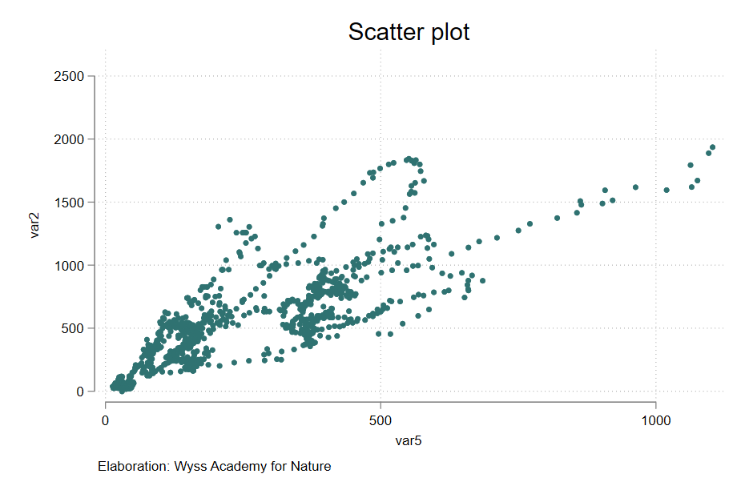
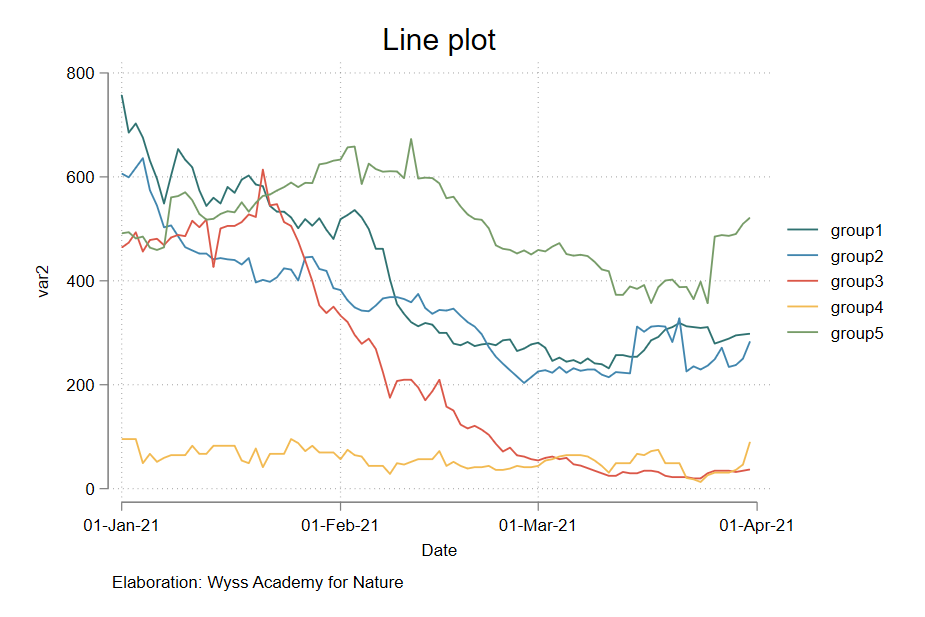
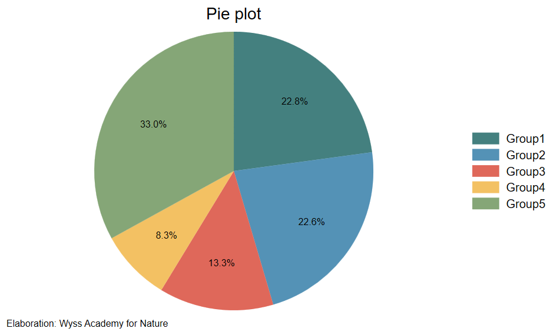
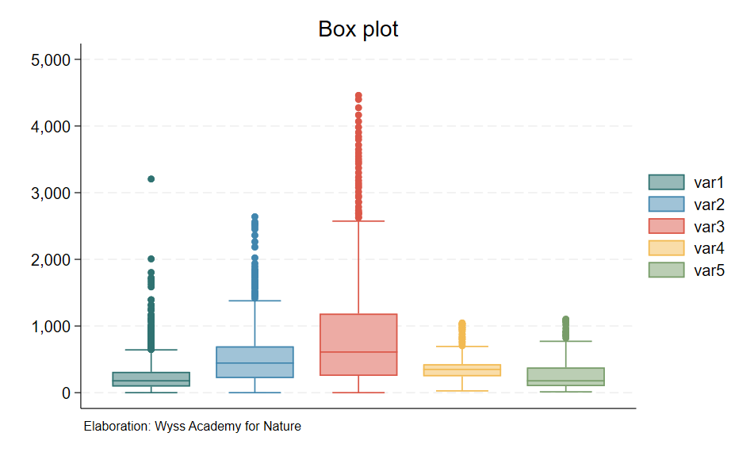
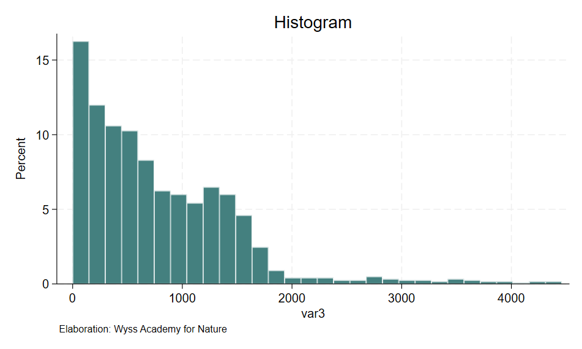
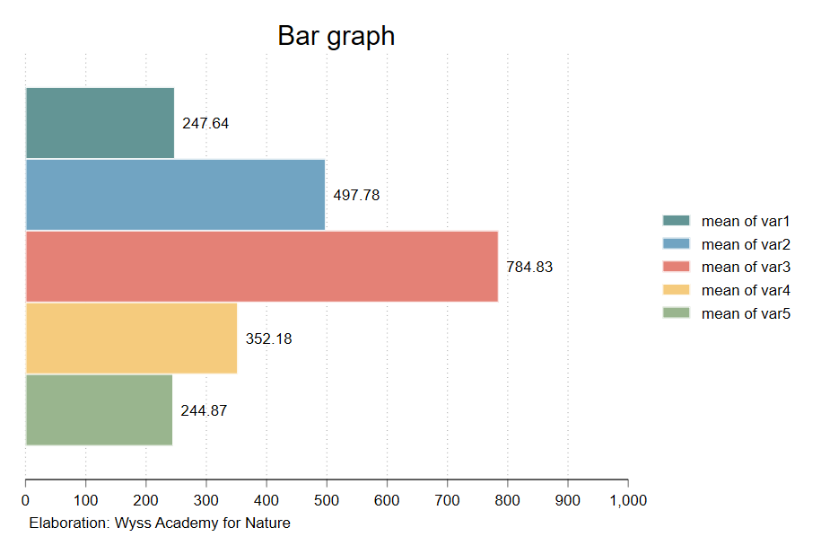
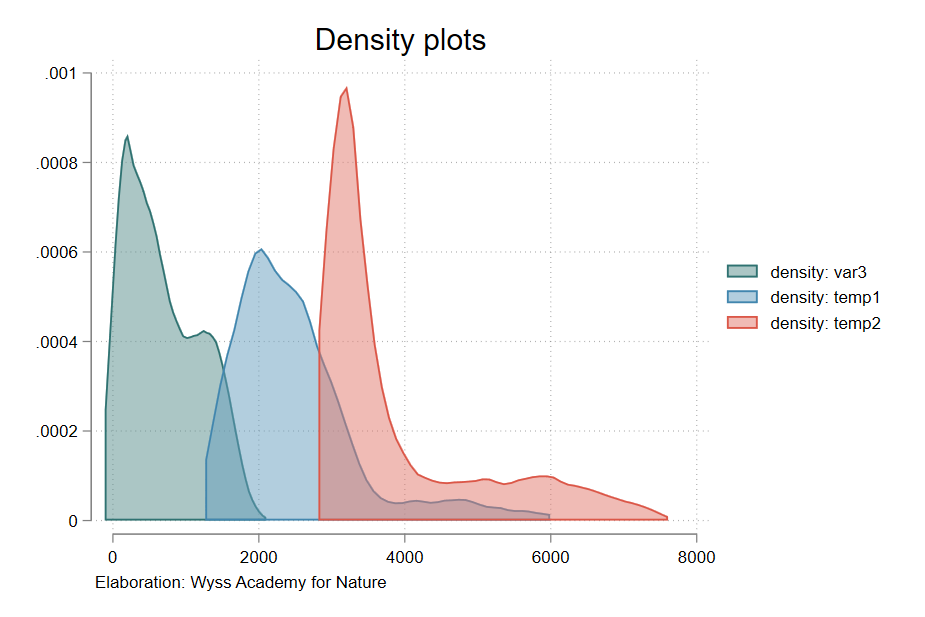
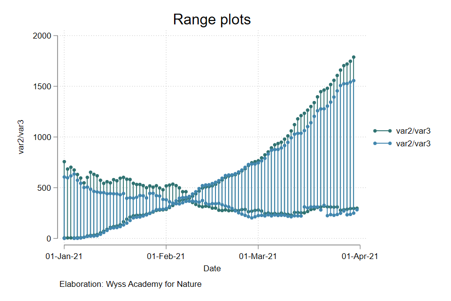
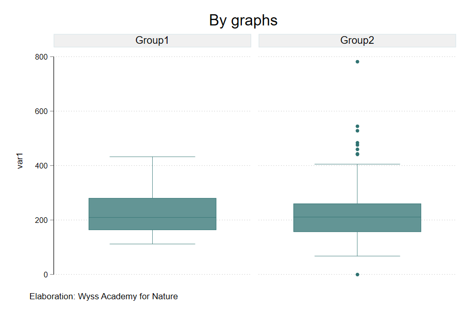

## wyssacademyplots

Description: Stata scheme of Wyss Academy for Nature.

## Installation
 ```
net install github, from("https://haghish.github.io/github/")
github install rmcondor/wyssacademyplots

set scheme wyssacademyplots
```

# Overview
 
 
 
 


## Author
Ronny M. Condor
